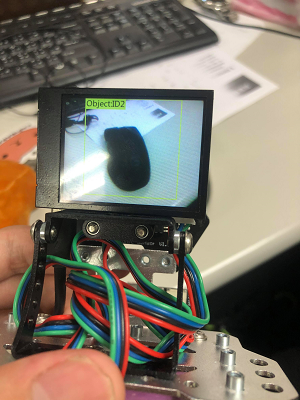

# AI for Kids 教案

####　麥坤小車＆AI辨識

* 龔柏丞 (120568)

* 人工智慧與系統應用部 (AISA)

## 程式編輯設定

* Microsoft MakeCode 網頁就可以撰寫 Scratch

  [連結](https://makecode.microbit.org/#editor)

* 新增麥坤自走車模組到 Makecode

  * 中間選單下滑

    點選MakeCode IDE中的 進階->擴展->搜尋 **dfrobot**->選擇以下模組安裝

  * ****

  * 安裝完成後會出現以下關於DFRobot Maqueen Plus的新模塊
    * Maqueen Plus
    * Maqueen IR

* 新增AI辨識模組哈士奇到 Makecode，選擇左邊哈士奇模組 (HuskyLens)

  

  * 新增完成後出現模組

    * HuskyLens

## micro bit 與 AI哈士奇麥坤小車模組 demo01
* 初始化哈士奇與麥坤小車模組
  
* 初始化成功後原地轉圈兩秒，然後顯示打勾勾畫面
  
* 然後每0.5秒辨識畫面中是否有人臉出現，如果出現發出聲音，沒有則打叉

* 範例 **demo01.hex**

## micro bit 循跡繞圈

* 初始化麥坤小車模組

* 初始化成功後顯示打勾勾畫面

* 透過車子底部的六個循線sensor 來感知目前的黑線狀態

* Maqueen 小車循跡 sensor，從底部往上拍，左到右為 R3, R2, R1, L1, L2, L3

* 如果sensor L2 辨識到黑色線，以下方塊模組會產生True

* 範例 **demo02.hex**

## 哈士奇AI辨識鏡頭

* 哈士奇鏡頭操作，哈士奇比較耗電，需要連著micro usb才能使用

* 哈士奇AI辨識功能只透過長壓按鈕就可以學習，不需要透過任何程式

### 物件辨識(Object Recognition)的學習
* 哈士奇的物件辨識中，將最常看到的一些類別訓練好了，例如:人、狗、貓、瓶子、螢幕等等，總共20個分類

* 開啟Object Recognition功能，當螢幕出現+號，用+號對準要學習的物體，長壓學習按鍵，就可以讓哈士奇 學習，然後學習過後的物體會出現ID編號 (bottle:ID1)

 

* 注意: Object Recognition 不能分別同個類別下的不同物件!!! 

* 學習只是讓我們有一個ID 與類別對應，讓我們可以對類別ID做程式上的處理

### 物件分類(Object Classification)的學習

* 在分類問題中，哈士奇可以學習自己給定的類別分辨東西
* 畫面上會產生一個固定的框框，只要將想學習的物體對準+號，長壓學習按鍵，即可開始學習方框中物體。也可以轉動視線角度，讓學習得更好

 

* 要學習第二個物體，只需要第一個物體學習完畢後，短按學習按鍵，就能夠再次學習新物體(長壓學習按鍵)，如果不想學習新物體，就按學習鍵以外的其他按件，就可以結束學習，開始分類推論模式

  

* 開始分類推論模式， 將物體移動到框框中，會顯示該物體被預測的類別，如果是沒看過的物體，則會顯示**Object: ID0**

  

## 手勢操作麥坤小車

*　透過以上的分類學習的方法，將剪刀、石頭、布手勢對應學習成 **ID 1, ID 2, ID 3**，就能透過剪刀石頭布手勢來遙控麥坤小車

* 範例 **demo03.hex**
